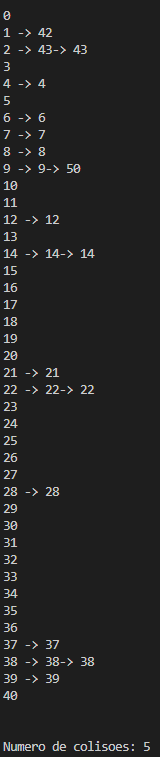

# Tabela Hash fechada

 
 

 

 

A tabela hash fechada se diferencia de uma tabela hash normal no caso em que ele tem um tamanho fixo só que em cada posição em vez de só guardar um valor se guarda uma lista de valores, mais sobre em <a href="https://github.com/mpiress/HashTable#readme">HashTable</a>. Quando um valor é adicionado na tabela hash fechada é feito o mod do valor com o tamanho da tabela, que este é o próximo primo do dobro da quantidade de entradas, para saber em qual posição o valor deve ser adicionado, se a posição estiver vazia o valor é adicionado nela senão estiver vazia em vez de colocar o valor na próxima posição possível o vlor é colocado depois do valor já existente. Isto é possível pois cada poição da hash é uma lista, logo com as posições são listas podemos saber qual valor de posição está repetindo várias vezes. 

# Resultados

O resultados obtidos foram que houve 5 colisões com as seguintes 20 entradas:  14, 38, 8, 14, 9, 28, 37, 43, 6, 22, 21, 39, 42, 43, 12, 7, 22, 50, 38, 4.
   Imagem do resultado printado pelo código:

# Compilação e Execução

A tabela hash fechada disponibilizada possui um arquivo Makefile que realiza todo o procedimento de compilação e execução. Para tanto, temos as seguintes diretrizes de execução:

| Comando                |  Função                                                                                           |
| -----------------------| ------------------------------------------------------------------------------------------------- |
|  `make clean`          | Apaga a última compilação realizada contida na pasta build                                        |
|  `make`                | Executa a compilação do programa utilizando o gcc, e o resultado vai para a pasta build           |
|  `make run`            | Executa o programa da pasta build após a realização da compilação                                 |

